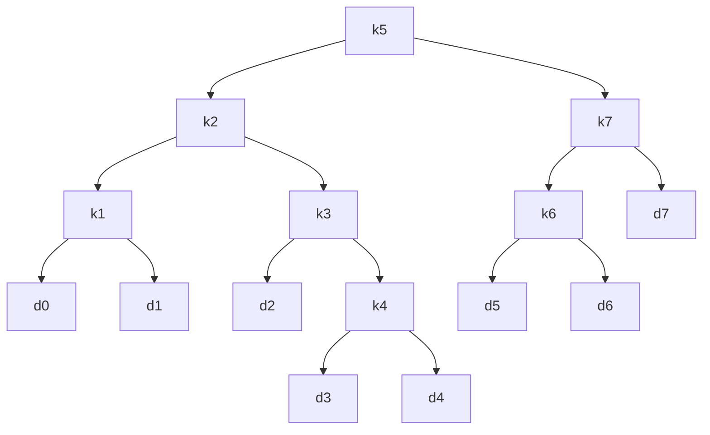

# Algorithm HW 6

## Author PB18030980

## name 高海涵

## Question1

算法设计如下，假定切割长度为n的钢条分割得到的最大收益为r<sub>n</sub>

切去长度为i的钢条之后，剩下的钢条长度为n-i,收益为r<sub>n-i</sub>

可以得到递推式r<sub>n</sub>=max(p<sub>n</sub>,max(p<sub>i</sub>+r<sub>n-i</sub>-c)) i=1,2,3...n-1

使用一个数组存储r<sub>n</sub>

```c
int r[n];
int valuetable[n];//value can get from different length of material
int max(int a,int b){
    return (a>b)?a:b;
}
void cost(int n,int costofdivide){
    //cost of divide is the cost spent in divide the material
    if(n==1){
        r[1]=valuetable[1];
        return ;
    }
    else{
        int maxcost=0;
        for(int i=1;i<n-1;i++){
            cost(i,costofdivide);
            if(maxcost>r[i]+valuetable[n-i]-costofdivide)
                maxcost=r[i];
        }
        r[n]=max(valuetable[n],maxcost);
        return ;
        
    }
}
```

## Question2

assume $$V(G)=n,and$$ there is vertices named with v<sub>1</sub>​, v<sub>2</sub>, ...,v<sub>n</sub>

s and t are vertices in the set V(G)

maintain a record which is $$length[i][j]$$ and that represents the longest paths from vertices i to j

If we can't find an available path between vertice i and vertice j,$$length[i][j]=0$$

$$length[s][t]=length[s][i]+length[i][t] $$for any vertice i !=s and i!=t

## Question3



cost = 3.12

## Question 4

翻译一下这个问题，现在有一棵树，每个结点存在一个权值，如果根节点被选中，那么它的子节点不能被选中，现在要求是求这个树上节点的一个集合，满足上述条件并且使得权值之和最大化

现在我们用孩子-兄弟表示法表示一个公司内部的上下级关系，对于任何一个顶点p，可以规定value[p]代表以顶点p为根的树所能得到的最大交际和，我们分为以下两种情况进行讨论

* 树根p不被选择邀请聚会,此时最大交际和为value0[p]
* 树根p被选择邀请聚会，此时最大交际和为value1[p]

value[p]=max(value0[p],value1[p])

### 结点p没有被选择聚会

则p的儿子可以被选择参加聚会。也可以选择不参加聚会，value0[p]=sum(max(value0[pi],value1[pi])),pi是p的儿子

### 结点p选择参加聚会

则p的儿子都不可以参加聚会。value[p]=score[p]+sum(value0[pi]) pi是p的儿子

算法的时间复杂度是O(n) ,每个结点分析时间的开销是常数时间，总的时间开销是线性时间，n是节点的数目

## Question 5

* step1 : Choose the smallest Node in the set
* step2 : Use the Node selected in step1 to become the lower bound of the closed closure
* step3 : delete the Nodes which are within the closure from the set. If the set is empty,the process will be terminated and if not, the process will go to step1

## Question 6

假设找n美分零钱需要的最少硬币数是a<sub>n</sub>,可以开一个大小为n的数组，记录下找1美分到n美分需要的最少硬币数

```C
int record[n];
int cal[n]={0};//0 represents this isn't calculated
int numberofreturn(int n){
    if(n==1)
        a[n]=1;
    else if(n>1&&n<5)
        a[n]=n;
    else if(n==5)
        a[n]=1;
    else if(n>5&&n<10)
        if(cal[n]==0)
        	a[n]=min(numberofreturn(i)+numberofreturn(n-i));//i is from 1 to n-1
    else if(n==10)
        a[n]=1;
    else if(n>10&&n>25)
        if(cal[n]==0)
        	a[n]=min(numberofreturn(i)+numberofreturn(n-i));
    else if(n==25)
        a[n]=1;
    else
        if(cal[n]==0)
			a[n]=min(numberofreturn(i)+numberofreturn(n-i));
}
```

假设可以找到n-1美分最优解

对于n美分的最优解，必然是拆成换i美分和n-i美分两个最优解之和，否则可以使用粘贴-替换法反证

