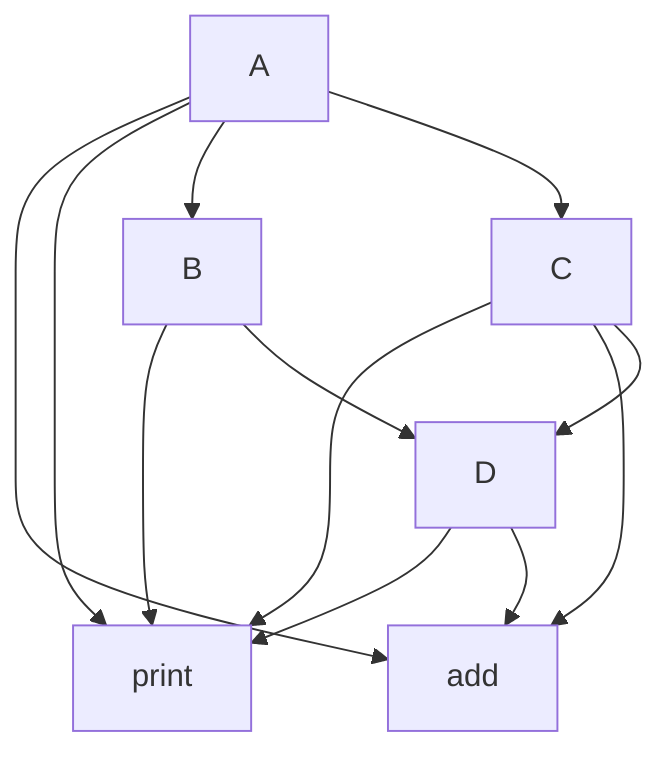

## Question 1

类的继承关系：




分析以下两个名字

* add，这个方法在class A,C,D中出现过
* print，这个方法在class A,B,C,D中出现过

(1)使用nm指令打印出出现的符号常量


对其中一些符号进行demangle


(2)虚继承和非虚继承内存布局和方法表布局

### 虚继承

#### 继承关系一览


* 非虚继承，代码保存在`non_virtual.cpp`中，简单地说就是定义了四个类，A,B,C,D，他们有一个方法名叫print，他们的成员变量名不相同

类之间的继承关系采取以下方式继承

```cpp
class D: public B,public C
class C: public A
class B: public A
```

#### 讨论内存布局

为了讨论内存布局，我们在main函数内使用以下语句，我们在本次作业最后会附上非虚继承各个派生类的内存布局，这里使用强制类型转换验证一些结论，这里需要说明的是

**基类A被继承了两次，在D的属性中，A存在两份，这两份内容不相同**

采取以下方式验证这个结论

main函数内以下代码

```cpp
int main(){
    D*p=new D;
    C*pc=p;
    cout<<p<<endl;
    cout<<pc<<endl;
}
```

输出结果


两个地址值不相同，相差8个字节，正好是两个int的size

下面使用一个具有歧义的代码，验证D的实例中含义两个A的副本

```cpp
int main(){
    D*p=new D;
    A*pc=p;
    cout<<p<<endl;
    cout<<pc<<endl;
}
```

内存中存在对象A的两个副本，不知道指向谁，所以编译时报错


现在我们换种写法

```cpp
int main(){
    D*p=new D;
    B*pb=p;
    A*pc=pb;
    cout<<p<<endl;
    cout<<pc<<endl;
}
```

可以看到，输出了正确的结果


#### 讨论对象布局

这里并未重写print函数，所以每个类应该都有一个自己的函数表，继承类的成员函数应该放在派生类的函数表中

之后会列出函数表的内存布局         

### 虚继承 

修改B,C继承A的继承方式

```cpp
typedef class B: virtual public A
typedef class C: virtual public A
```

####  D的内存布局

只会含有一个A对象，可以用下面的代码验证

```cpp
int main(){
    D *p=new D;
    A *pa=p;
    cout<<p<<endl;
    cout<<pa<<endl;
    return 0;
}
```

运行结果为


#### D的方法表布局

每个基类都有自己的方法表，但是不同的是，基类中被重写的方法在基类的方法表中被重写的方法覆盖

## Question 2

emmm，题目中给出的代码貌似有问题，比如int main和f1返回值

(1)incline在c语言中代表内联，内联的目的是为了避免函数调用导致的堆栈开销采取的直接插入代码的方式，通过开不同层次的优化，我们可以发现，-O2优化告诉编译器函数需要内联到目标代码中

不加优化则直接采取函数调用

内联应该是在代码生成时进行，因为涉及到目标代码生成的问题

(2)优化包括：

* 禁止内联函数展开，使用函数调用的形式实现控制流跳转
* f(a)实际上没有修改a内存单元的值，所以从函数整体上看，执行f和不执行不会带来影响，这里将其优化了
* f1传参数用的是立即数加载到参数寄存器中进行传值，没有优化之前先将堆栈内存中的内容加载进寄存器，然后从寄存器中转移到参数寄存器中实现传值，实际上这里参数传递的值编译时可以确定，就省去访问内存这一部分

(3)声明为static的函数可以被所有模块内的函数调用，这就是静态函数的特点，static修改了函数的作用域，使其不再是全局的函数