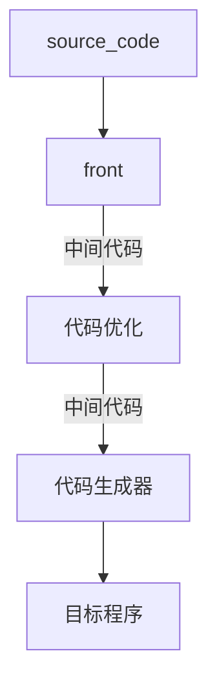

# 龙书阅读

## chapter 8 代码生成

### 代码生成器设计中遇到的问题

标准：生成正确的代码，易于实现、测试和维护

#### 代码生成器的输入

输入：中间表示和符号表，确定IR中名字指向的数据对象的运行时刻地址

#### 目标程序

##### 目标机器体系结构

* RISC
* CISC
* 基于堆栈的体系结构JVM

##### 程序重定位

* 绝对地址：程序可以很快地编译与执行
* 相对地址：可重定位，目标模块，需要链接器链接到一起加载到内存中执行
  * 可以将子程序分模块编译
  * 编译器需要向加载器提供明确的重定位信息

#### 指令选择

#### 寄存器分配

* 寄存器分配
* 寄存器指派

### 目标语言

#### 简单的目标机器模型

##### 指令集

* 加载运算，内存到寄存器值拷贝，寄存器到寄存器值拷贝
* 保存运算，寄存器到内存值拷贝
* 计算运算
* 无条件跳转
* 条件跳转

##### 寻址模式

* 位置是一个变量名x，指向分配给x的内存位置
* 一个位置可以是一个带有下标的地址，a(r)表示a的左值加上存放在寄存器r中的值计算得到的地址，数组访问基地址+偏移，上例中a可以为一个整数
* 间接寻址模式
  * *r表示寄存器r的内容指向的内存地址上存放的内容是一个地址
  * *100(R)需要先将100加上R寄存器的值得到的值作为地址，在内存中找到这个存储单元的值，然后将这个值作为地址找到对应的数据
* 加载常数进入寄存器

#### 程序与指令的代价

* 寄存器值拷贝代价为1
* 内存-寄存器值拷贝代价为2
* 间接访问内存代价为2

### 目标代码中的地址

#### 内存空间划分

* 代码区
* 静态数据区
* 栈区
* 堆区

#### 静态分配

