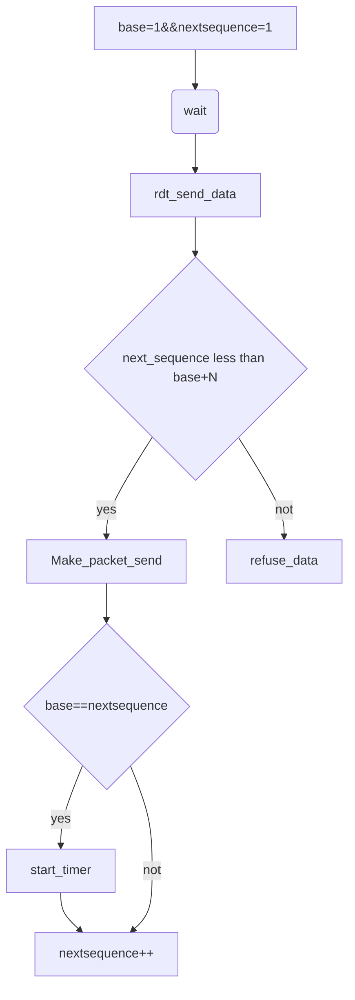
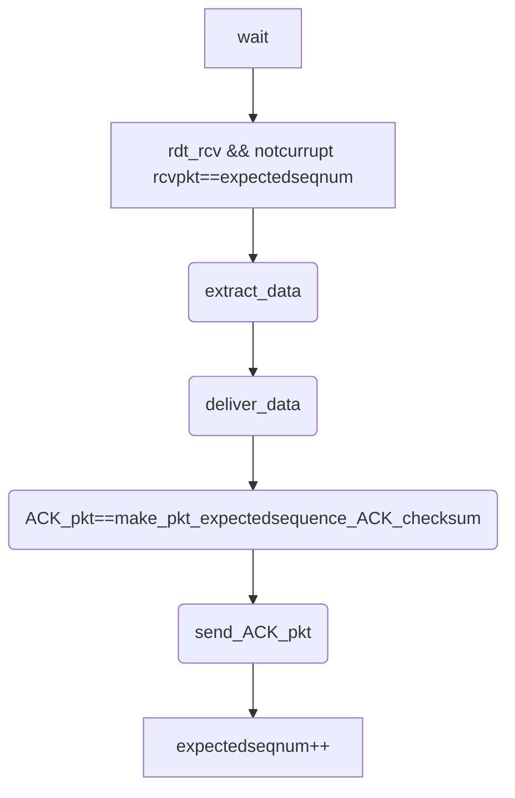

# Computer Network Chapter III---Transport Layer

## General and Service by Transport Layer

报文段segment从发送应用程序进程接收到的报文转换成传输层分组，该分组成为运输层的报文段

实现：应用报文划分成较小的块，并未每块加上一个运输层首部生成运输层报文段

运输层协议：TCP UDP

### 运输层&&网络层

网络层：提供了主机之间的逻辑通信

传输层：不同主机进程间的逻辑通信

传输层协议工作在端系统中，在应用层和网络层之间提供通信

传输层协议工作在网络层之上，提供的服务受制于底层网络协议的服务模型，比如带宽和时延保证

但是，底层网络协议同意不能在网络层提供相应的服务，运输层服务也能提供某些服务，底层网络协议不可靠，运输协议也能提供可靠的数据传输服务，另外的例子是加密

对网络层服务进行可能的增强，TCP和UDP不做延迟和带宽保障

### Internet运输层概述

#### IP网际协议

服务模型：尽力而为交付服务，但不确保，称为不可靠服务

UDP,TCP基本责任

### 多路复用和多路分解

#### 多路复用

传输层从网络层获得数据，但是可能存在多个进程，此时需要决定将数据发送给那个进程

每个套接字存在单独的标识符，标识符的格式决定了这是TCP还是UDP套接字

报文段包含域，在接收结尾，传输层检查这些域判断接收套接字并且将这些报文引导至特定的套接字，这一过程称为**多路分解**

依据头部信息交给正确的套接字-多路复用

从多个套接字接收数据并交给网络层-多路分用

#### 多路分解

从源主机不同套接字中收集数据，并为每个数据做封装首部信息，生成报文段，并将报文段传递至网络层，这一过程称为**多路复用**

报文定向到确定的进程-->通过定向到特定进程的套接字实现

#### 在计算机系统中的实际工作

要求：套接字存在唯一标识符 每个报文段存在特殊的字段指示报文段交付的套接字

源端口号字段 目的端口号字段 每个数据报带源IP地址，目的IP地址

网络层不会关心端口号信息

0-1023 周知端口号：HTTP（80）FTP(21)

#### 无连接的多路复用和多路分解

UDP socket（目的IP地址，目的端口号）

客户端：自动分配端口号 服务器端：分配特定的端口号

源端口号的作用：作为返回地址的一部分，源端口号和目的端口号可能反转

#### 面向连接的多路复用和多路分解

TCP socket=源IP地址+源端口号+目的IP地址+目的端口号

接收端利用四个值将segment导向socket

支持多个socket在同个端口号上，或者多线程的Web服务器

#### Web服务器与TCP

根据源IP地址和源端口号，Web服务器区分不同客户的报文段

Web服务器只有一个进程，但是为每一个新的用户创建一个具有新连接套接字的新线程

### 可靠网络传输的接口


### UDP协议

#### 基于Internet IP协议

* 复用/分用
* 简单的错误检测（端到端）

#### Best effort

* 丢失
* 非按序到达
* 无连接，发送方与接收方之间不需要握手
* 每个UDP段处理独立于其他段

#### Advanced point

* 头部开销少
* 实现简单
* 无需建立连接（减少延迟）
* 没有拥塞控制，应用可以控制发送时间

#### Reliable Data Transfer

* 应用层增加可靠性机制

#### 报文段格式

source port+dest port+length+checksum

##### UDP套接字是一个二元组，含有目的IP和端口

#### checksum

##### 发送方：

* 计算校验和并填入字段
* 将内容视为16-bit整数
* 计算所有整数的和，进位加在和的后面，得到的值按位取反，得到校验和
* 最高位进位必须加进去

##### 接收方

* 计算校验和
* 进行比对：相等仍然可能有错误，只是没有检测出错误

### 可靠数据传输原理

###### 可靠：不错，不丢，不乱

###### 可靠数据传输协议

底层服务不可靠

#### 接口

* rdt_send() 被应用调用，将数据交给rdt发送给对方
* udt_send() 被rdt调用，在不可靠信道上向接收方传输数据
* deliver_data() 被rdt调用，向上层数据交付数据
* rdt_rcv() 数据包到达接收方信道时被调用

#### 可靠信道上的可靠数据传输

#### 产生位错误的信道

* 错误的检测：位错误利用校验和
* 从错误中恢复
  * 确认机制：接收方告诉发送方分组已经正确接收
  * NAK:显式告诉发送方分组有错误
  * 发送方接收到NAK，重传分组
* 自动重传请求
* 解决ACK/NAK受损
  * 重传当前分组
  * 为了解决重传和新分组的区分，需要给报文一个序号作为标记，标记发送的分组序号，接收方检查序号判断是一次重传结果还是新的分组---序列号
  * 接收方丢弃重复分组

#### 具有比特差错而且可能丢包

解决：如果丢包，发送方等待较长的时间还没有得到接收方的响应，冗余数据分组

设计倒计时定时器：发送一个分组，就启动一个定时器，响应定时器中断，终止定时器

several question:Only NAK in rdt2.1?

状态转换图


### 流水线可靠数据传输协议

发送方利用率=实际发送方将发送比特加入信道的时间和发送时间

rdt3.0效率比较低，发送方利用率低

#### 解决方案：流水线

基本思想：发送方无需等待某个分组的ACK/NAK到达，可以连续发送多个报文

* 增加序号范围，每个输送中的分组必须有一个唯一的序号
* 协议的发送方和接收方必须存在多个分组，发送方应当缓存发送但是未被确认的分组，接收方应当缓存已经正确接收的分组
* 解决流水线差错：回退N步，选择重传

#### rdt3.0

信道极可能发生错误，有可能丢失分组->丢失数据分组和握手分组导致互锁

处理方法：发送方等待合理的时间

* 如果等待合理的时间没收到ACK，重传
* 新的问题：ACK延迟但是没有丢
  * 处理重复的分组，序列号
* 定时器

##### ACK loss

发送方等待一段时间知道超时还没有收到来自发送方的握手信号，此时，就会向接收方重新发送一个数据包，数据包的标识和上一次发送的数据包标识相同，此时如果接收方接收到重传的数据包，就会判断该种数据包和之前发送的数据包种类相同，接收方会删除重复的分组，并且向发送方发送一个接收信号

##### Packet Loss

发送方超时，直到计时器关闭

##### 性能分析

性能比较差，假设带宽是R =1Gbps,RTT =15ms端到端延迟，L =1KB分组

U<sub>sender</sub>=$$L\div R \div(RTT+L\div R)$$=0.00027

网络协议限制了物理资源的利用，由于停等操作导致的

##### ACK 延迟（Timer设置短）

重复分组到达接收方，接收方收到重复分组并且将重复分组删除，同时向发送方发送一个Ack

### 回退N步(滑动窗口协议)与流水线机制

#### 流水线机制：提升网络利用率

* 更大的序列号范围
* 发送方/接收方需要更大的存储空间缓存

#### Def：

窗口：允许使用的序列号范围 尺寸为N：最多有N个等待确认的信息

滑动窗口：窗口随着协议的运行，串口在序列号空间内向前滑动

基序号：最早的未确认分组的序号

下一个序号：最小的未使用序号

包含k bits序列号

窗口尺寸N

**累计确认：ACK(n)确认到序列号n(包含n)的分组均已被正确接收，可能收到重复的ACK**

为空中的分组设置定时器

超时事件，Timeout(n):重传序列号**大于等于n**，还未收到ACK的所有分组

#### 分段

base指向已经确认的分组的下一个分组序列号

nextseqnum指向已经接受但是没有确认的分组的下一个序列号

[0,base-1] 已经接收并已经确认的分组

[base,nextseqnum-1] 已经发送但是未被确认

[nextseqnum,base+N-1] 段内的序号用于那些要被立即发送的分组

[base+N] 以上，不能使用

N 称为窗口长度，GBN称为滑动窗口协议

TCP序号按照字节进行计数


#### 发送方


初始，nextsequencenum=base=1

这是发送方从上层接收到一个数据包处理的流程图



收到ACK的流程图,累计确认，窗口滑动

```mermaid
graph TD
wait-->A(rdt_rcv && notcorrupt)-->base=getacknum+1-->judge{base==nextquence}--yes-->stop_timer
judge--not-->start_timer
```


* 上层调用rdt_sent()发送方检查发送窗口是否满，如果窗口未满，则产生一个分组将其发送，并更新变量，窗口已满，则将数据返回给上层，指示窗口已满
* 收到ACK，在GBN协议中，对序号为n的分组确认采用累积确认，表明接收方已经正确接收到序号n以前包括序号n在内的所有分组
* 超时事件：如果出现超时，发送方重传所有已发送但是还没有确认过的分组
* 序号采用有限的比特位表示，k位比特位可以表示$2^k$个序号

#### 接收方

##### ACK机制：发送具有最高序列号的，已经被正确接受的分组的ACK

* 可能产生重复的ACK
* 只需要记住唯一的expectedseqnum(当前期望收到的序列号)

##### 乱序到达的分组

* 直接丢弃，接收方没有缓存
* 重新确认序列号最大的，按序到达的分组,重新发送之前到达最大分组的ACK，可能出现ACK重复
* 若发送方收到了确认号为n的帧，那么代表发送方发送的前n+1个数据帧接收方均收到，但是并不代表接收方一定收到了n+1个ACK，因为接收方向发送方发送ACK时可能出现丢失相应包的情况

理想接收的流程图




* 如果序号为n的分组被正确接收到，并且按序，则接收方为分组为n发送一个ACK，并将分组中的数据部分发送给上层、
* 在所有其它情况下，接收方丢弃该分组，并作为最近按序接受的分组重新发送ACK
* 丢弃所有失序分组，接收方必须将数据包按序交付给上层

### 选择重传

#### GBN缺点

#### Selective Repeat的基本思想

* 接收方对每个分组单独进行确认
  * 设置缓存机制，缓存乱序到达的分组
* 发送方只重传没收到ACK的分组
  * 为每个分组设置定时器
* 增加接收方窗口


#### 发送方

* 从上层收到数据，SR发送方检查下一个可以用于该分组的序号，如果序号位于发送方发送窗口内，则将数据打包并发送，否则将数据缓存或返回给应用层之后传输
* 超时，定时器用于防止丢失分组，每个分组必须有自己的逻辑分析器
* 收到ACK,收到ACK,并且该分组序号在窗口内，发送方将已经确认的分组标记为已接受，如果分组的序号等于send_base，则窗口序号向前移动到具有最小序号的未确认分组处，如果窗口移动了并且有序号落在窗口内的未发送分组，则发送这些分组
* timeout(n) send pkt n and start timer
* ACK(n)
  * mark pkt n as received
  * if n is the smallest unACKed pkt,advance windwo base to next unACKed seq(滑动)

#### 接收方

确认一个正确接受的分组不管其是否按序，失序的分组将被缓存直到所有丢失分组（序号更小的分组）都被收到为止

* 序号在[rec_base,rec_base+N-1]内的分组被正确接收，接收的分组落在接收方的窗口内，一个选择ACK被回送给发送方，如果该分组在之前没有被受到过，则缓存该分组，

#### SR困境 序列号不足

导致不能区分新发的数据包和重发的数据包 假设用k位表示序列号，序列号空间大小和窗口尺寸应该满足 N<sub>s</sub>+N<sub>r</sub><$2^k$

## TCP Transmit control protocol

### 基本思想

* 点到点
  * 一个发送方，一个接收方
* 可靠的，按序的字节流
* 流水线机制
  * TCP拥塞控制和流量控制机制设置窗口尺寸
* 发送方，接收方缓存
* 全双工
  * 同一连接能够可以双向传输数据流
* 面向连接
  * 发送数据之前必须建立连接
  * 连接状态只在通信两端维护，中间节点并不维护状态
  * TCP连接包括：
    * 两台主机上的缓存
    * 连接状态变量
    * socket
* 流量控制机制

### TCP段结构

source port+desk port

sequence number

acknowledgement number

head length+not used+URG+ACK valid+PSH(push data now)+RST+SYN+FIN+receive window

checksum+Urg data pnter

Options(variable length)

Application data(variable length)


* 序列号
  * 序列号指的是segment中第一个字节的编号而不是segment编号
  * 建立TCP连接时，双方随机选择序列号
* ACK
  * 希望收到下一个字节的序列号
  * 累计确认，该序列号之前的所有字节均被正确接收到
* segment乱序到达
  * TCP没有规定，由实现者实现

### TCP可靠数据传输概述

* 在IP层提供的不可靠数据传输服务基础上实现可靠数据传输
* 流水线机制
* 累积确认
* TCP使用单一重传定时器
* 触发重传的事件
  * 超时
  * 收到重复ACK
* 暂时不考虑重复ACK 流量控制 拥塞控制

### TCP RTT超时

#### Question :How to set RTT

#### Question :How to estimate RTT

SampleRTT:测量从段发出去到收到ACK的时间，忽略重传

SampleRTT的变化：测量多个SampleRTT，求平均值，形成RTT的估计值，EstimatedRTT

$$EstimatedRTT=(1-\alpha)\times EstimatedRTT+\alpha \times SampleRTT$$

加权移动平均

#### 定时器超时时间的设置

测量sampleRTT和EstimatedRTT的差值

**$$DevRTT=(1-\beta)\times DevRTT+\beta \times|SampleRTT-EstimatedRTT|$$**

定时器超时时间的设置

$$TimeoutInterval=EstimatedRTT+4\times DevRTT$$

### TCP sender event

* 从应用层收到数据
  * 创建segment
  * 序列号是segment第一个字节的编号
  * 开启计时器
  * 设置超时时间 TimeoutInterval
  * Nextsequencenumber=Nextsequencenumber+length(data)
* 超时
  * 重传引起超时的segment(只会重传引起超时的一个segment)
  * 重启定时器
* 收到ACK
  * 如果确认此前未确认的segment
    * 更新Sendbase
    * 如果窗口中还有未被确认的分组，重新启动定时器

###  几个case

#### case 0 ACK loss


#### case 1 Timeinterval too short


#### case 2 累计确认


### 接收方

| 接收方事件                                              | 接收方动作                                               |
| ------------------------------------------------------- | -------------------------------------------------------- |
| 顺序到达数据段，而且之前的数据都已经按序到达且发送过ACK | 等待500ms，如果在等待时间内没有新的段到达，那么就发送ACK |
| 一个段按序到达，并且前面有一个段等待ACK                 | 立即发送累计确认ACK，确认这两个段都到达                  |
| 到达一个乱序的段，比期望到达的序列号更靠前              | 重复发送ACK，表明期望的段                                |
| 到达一个段，能够完整地覆盖上一个事件产生的gap           | 立即发送更新的ACK，指示期望收到的段的字节号              |

### 快速重传机制

* TCP实现中，如果发生超时，超时时间将会重新设置，将超时间隔加倍，导致超时时间很长
  * 直接后果是，采用Timeout重传丢失的分组需要等待很长时间
* 流水线机制：检测重复的ACK
  * sender会收到多个重复的ACK
  * 收到多个重复的ACK，表明接收方希望接受的数据段没有接收到
* 具体实现：sender收到三个对统一数据的相同ACK，那么假定该数据之后的段已经丢失
  * 快速重传，在定时器发生之前进行重传
* 算法 

### TCP流量控制

接收方分配buffer，上层应用处理buffer速度较慢，可能导致buffer溢出，流量控制是一种速度匹配的机制

#### Buffer

* buffer中存在一部分被数据占用，一部分空出(spare room)
  * recwindow=revbuffer-[lastbytercvd-lastbyteread]
* reveiver通过在segment的头部字段将RecWindow告诉sender
* sender限制自己已经发送的但是还没收到ACK的数据不能超过接收方空闲的RecWindow尺寸
* 互锁：Receiver告诉sender接收窗口为0，导致发送方不发数据，导致接收方不告诉sender发送数据的窗口大小，导致互锁
  * 发送方发送一个很小的段，以获得新的receiver信息，避免死锁的情况

### TCP连接管理

TCP连接的建立和拆除

#### 连接的建立

* TCP sender和receiver在传输数据前需要建立连接
* 初始化TCP变量
  * seq
  * Buffer以及流量控制
* client：产生一个新的socket
* Server：等待连接

#### 三次握手

##### step1:客户主机发送一个含有SYN报文段的空报文

* SYN置为1
* 选择初始序列号

##### step2:服务器收到SYN,返回一个SYNACK的报文段

* 服务器分配缓存
* 选择自己初始的序列号告知客户端

##### step3:客户机收到一个SYNACK报文段，返回ACK，可以包含数据

* SYN置为1

#### 四次挥手

##### Step1：client向server发送TCP FIN控制segment

##### step2: server收到FIN回复ACK，关闭连接，发送FIN

##### Step3:client收到FIN，回复ACK，进入等待，如果收到FIN,会重新发送ACK

##### Step4：client收到ACK，连接关闭

## 传输层拥塞控制管理

* 拥塞：发送主机发送了太多的数据或者发送数据太快导致网络无法处理
* 表现：
  * 分组丢失-整个网络角度控制网络负载
  * 分组延迟过大
* 流量控制&&拥塞控制

### 拥塞的成因

case 1 路由器无限缓存，数据都能到达，分组不会丢失

路由器输出和输入关系


路由器时延和输入


case 2 路由器有限buffer，导致数据丢失

数据丢失导致重传

case 3 路由器缓存有限，多条路径

### 拥塞控制原理

基本思想：管制发送方的发送速率

基本方法

* 端到端拥塞控制
  * 网络层不需要提供支持
  * 端系统观察loss和delay判断是否发生拥塞
  * TCP
* 网络辅助的拥塞控制
  * eg ATM ABR拥塞控制
  * ABR available bit rate
  * 存在RM cell资源管理
  * NI bit：不允许增长
  * CI bit：拥塞指示
  * 数据cell中的EFCI位也可以标识拥塞

## TCP拥塞控制

### 几个基本问题

* 如何控制发送速率（CongWin）
  * 设置拥塞窗口变量，发送的数据大小小于拥塞窗口
  * lastBytesent-lastByteAcked<=CongWin
* 设置CongWin大小
  * 动态调整大小
  * 反映所感知的网络拥塞
* 如何感知网络拥塞
  * Loss事件=timeout或三个重复ACK
  * 发生loss事件后，发送方降低速率
* 如何调整发送速率
  * 加性增-乘性减：AIMD
  * 慢启动：SS

### AIMD

#### 原理：逐渐增加发送速率，谨慎探测可用带宽

#### 方法：AIMD

* Additive increase：每个RTT将CongWin增大一个MSS——拥塞避免
* 发生loss之后将CongWin减半

### 慢启动

* 可用带宽远远高于初始速率
  * 希望快速增长
* 原理：连接开始时，指数增长
* 指数增长
  * 每个RTTCongWin翻倍
  * 收到每个ACK进行操作
* 初始速度

### 问题：指数增长->AIMD

CongWin达到Loss事件前值的1/2

#### Threshold变量

* Loss事件发生时，Threshold设置为Loss事件前CongWin的1/2
* 检测到loss，直接将Congwin降低为1（老版本）
* 检测到loss，直接将CongWin降到一半，然后线性增长

### 检测拥塞

#### 3个重复ACK

* CongWin切到一半
* 然后线性增长
* 因为收到ACK说明网络拥塞没有那么严重

#### Timeout

* CongWin直接设置为1个MSS
* 指数增长，直到threshold

### TCP拥塞控制算法

Th代表Threshold，应该赋给初始值

```C
Th=xxx;
CongWin=1 MSS;
while(No packet and CongWin < Th){
    send CongWin TCP segments
        for each ACK increase CongWin by 1
}
while(No packet Loss and CongWin>= Th){
    send CongWin TCP segments
    for CongWin ACKs, increase CongWin by 1
}
Th=CongWin/2;//Loss happened
if(3 Dup ACKs) CongWin = Th;
if(timeout) CongWin=1;
```

