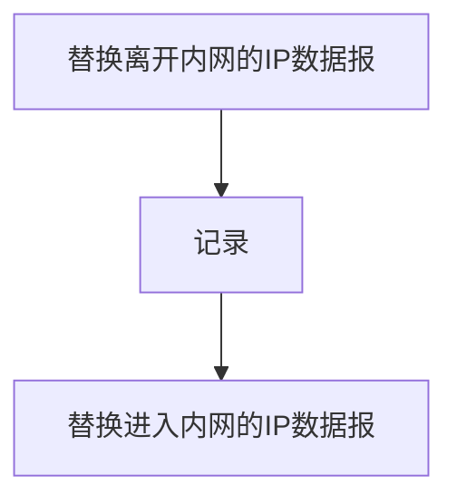

# Network layer -- HIT

## 网络层概述

### 基本任务

* 实现主机与主机之间的通信
* 发送主机：将数据段封装到数据报中
* 接收主机：向传输层交付数据段
* 每个主机和服务器都运行网络层协议
* 路由器检验所有穿越它的IP数据报头部域

### 网络层核心功能-转发和路由

* 转发：分组从路由器输入端口转移到合适的输出端口（转发表）
* 路由：确定分组从源到目的经过的路径（路由算法/协议）
* 连接建立
  * 只是属于某些网络
  * 数据分组传输之前建立虚拟/逻辑连接
  * 网络设备参与连接的建立
  * 端到端的传输层连接对于中间主机是透明的
* 网络为网络层提供了什么服务模型？
  * 尽力传输（Internet）
  * CBR/VNR/ABR/UBR

### 网络层服务模型

* 无连接服务
  * 不事先为系列分组确定传输路径
  * 每个分组可能传输路径不同
  * 每个分组传输路径不同
  * 数据报网络
* 连接服务
  * 首先为系列分组传输确定源到目的经过的路径，建立连接
  * 虚电路网络

## 虚电路网络

* 主机到主机的服务
* 网络核心实现

### 虚电路

一条源主机到目的主机的类似于电路的路径，是逻辑连接

* 分组交换
* 每个分组传输利用全部带宽

### 通信过程

* 呼叫建立 分配虚电路VCID
* 数据传输
* 拆除呼叫

携带相同vcid的分组走相同的路径，分组携带的不是目的地址

### VC的实现

* 路径
* 虚电路号

### 虚电路信令协议

* 用于VC建立维护和拆除
  * 路径选择
* 适用于虚电路网络
* 初始呼叫-呼叫到达-接受呼叫-呼叫建立-传输数据-连接拆除

## 数据报网络

* 网络层无连接
* 每个分组携带目的地址
* 路由器根据目的地址转发
  * 路由算法构建转发表
  * 检索转发表
  * 每个分组独立选路，一次传输中不同分组传输路径可能不同
  * Internet网络，地址指的是IP地址，32位二进制数-不可能存储所有IP

### 转发表 -最长前缀匹配原则

减少转发表开销-（目的IP范围，输出链路）

连续地址划分

非连续地址划分：前缀比对确定转发目标，无法匹配选择缺省路由 

一个地址在多个范围内，满足最长前缀匹配

用于匹配的地址（前缀）越小，满足的地址范围越大

### 对比-数据报网络 && VC网络

#### 数据报网络

* 计算机之间的数据交换
  * 弹性服务，没有严格的时间要求
* 链路类型众多
  * 特点，性能各异
  * 统一服务困难
  * 跨网络通信
* “智能”端系统
  * 可以自适应，性能控制，差错恢复
  * 简化网络，复杂边缘

#### VC网络

* 电话网络演化而来
* 核心业务是实时对话
  * 严格的时间、可靠性需求
  * 有保障的服务
* dumb端系统
  * 电话机、传真机
  * 简化边缘，复杂网络

## IPv4协议

### 主要功能

* 路由
  * 路由协议
* 转发表
  * IP协议
    * 怎样寻址
    * 数据报格式
    * 数据报处理
* ICMP协议
  * 差错报告
  * 路由器信令

### IPv4数据报结构

#### 首部

##### 固定部分20byte

* 版本号：IP协议版本，4bit
* 首部长度：4bit->头部长度超过？**以四字节为单位**，首部长度$\times$4=实际的首部长度
* 服务类型：8bit
  * 最初指示期望获得何种服务
  * 区分服务：优先转发
  * 前提是网络提供区分服务
  * 一般取0
* 总长度：16bit，最大65535byte，首部+数据
* 生存时间TTL：8bit，标识IP分组在网络中可以通过的路由器数(跳步数)
  * 路由器每经过一次转发，TTL-1
  * TTL=0，路由器丢弃该分组，并向源主机发送ICMP报文
  * **可以防止数据包环路**
  * 协议号（Protocol），端口号（Port），类型值（Type）
* 协议字段，指示封装的**上层协议**是什么，TCP/UDP
  * 复用、分解
  * 调用适合的上层协议处理数据报
* 首部校验和：实现对IP分组首部的差错检测
  * 每次转发重新计算，重新校验
  * UDP相同
* 源，目的IP地址，各32bit
* DSF(服务区分符)：确保被优先转发

##### 可变部分（1-40B）

很少被使用

##### 填充域

保证首部长度为4字节的倍数

#### 数据

### IP分片

#### 最大传输单元

网络层产生的数据报在链路层被封装为数据帧

MTU：最大传输单元，代表链路层可以封装数据的上限

MTU和链路有关，MTU不匹配

#### 分片与重组

大的IP分组向较小的MTU转发，**可以**被分片

* 一个IP分组被分为多片IP分组-fragmented
* IP分组到达**目的主机**后进行重组-reassembled

IP首部的字段参与标识分片和分片的相对顺序

* IP总长度，标识，标志位，片偏移

#### 标识字段

16bit

每产生一个IP字段，标识+1

结合源主机，目的主机判断

#### 标志位字段

保留+DF(Don't Fragment)+MF(more fragment)

* DF=1,禁止分片 DF=0 允许分片
* MF=1，不是最后一片，MF=0，最后一片（或没分片）

#### 片偏移字段

13bit

一个IP分组分片封装原来IP分组数据的相对偏移量

以8字节为单位-首部长度，除了最后一片，一定是8的倍数

#### IP分片过程

原分组长度为L，转发链路MTU为M

* L>M而且DF=0,则可以、需要分片
* 每个分片保留原分组标识
* 除了最后一个分片，其它分片大小均是MTU而且是8的倍数

### IP编址

#### IP数据报的地址

* 源地址
* 目的地址

#### 接口：主机/路由器与物理链路的连接

* 实现网络层功能
* 路由器多个接口
* 主机一个或两个接口

#### 网络层的IP编制

##### IP地址

32bit二进制数，表示主机、路由器的**接口**

点分十进制IP地址

IP接口与接口相关联，对于主机，就是主机的IP地址

##### 分配IP地址的规则

* 分段
  * 网络号-高位比特
  * 主机号-低位比特
* 具有相同网络好的接口称为IP子网，在同一个输出链路上
  * 不跨越路由器设备可以彼此物理联通
  * IP子网地址

### 有类IP地址

网络号+主机号=32bit

#### 有类编址-对IP地址进行人为划分

* A类地址，0.0.0.0-127.255.255.255 32位比特以0开头  NetID 8bits HostID 24bits，实际可用的网络号为7位
* B类地址 128.0.0.0-191.255.255.255 32位比特以10开头 NetID 16bits HostID 16bits，实际可用的网络号位14
* C类地址，32位比特位110开头 NetID 24bits HostID 8bits，实际可用的网络号21位
* D，1110 全部为网络号 D标识一组主机，只能作为目的主机，实际可用网络号为28，只能作为发送地址，多播地址
* E,1111 全部为网络号 保留

A，B，C均带有网络号和主机号，用于标识网络中的主机和接口

缺点，不灵活

#### 特殊的IP地址

| NetID  | HostID | 作为IP分组源地址 | 作为IP分组目的地址 | 用途                                                         |
| ------ | ------ | ---------------- | ------------------ | ------------------------------------------------------------ |
| 全0    | 全0    | 可以             | 不可以             | 本网范围内表示本机，路由表中表示默认路由                     |
| 全0    | 特定值 | 不可以           | 可以               | 子网内的某个特定主机                                         |
| 全1    | 全1    | 不可以           | 可以               | 广播地址，路由器不转发，在本网当中向本网广播                 |
| 特定值 | 全0    | 不可以           | 不可以             | 网络地址，表示一个网络，保证一个子网内所有主机网络地址相同   |
| 特定值 | 全1    | 不可以           | 可以               | 直接广播地址，对特定网络上的所有主机进行广播，发送的目的和源主机不在同一个子网中 |
| 127    | 任何数 | 可以             | 可以               | 环回地址，IP分组不会离开这个主机                             |

#### 私有的IP地址

仅用于内部网络，路由器对这些IP的数据报不转发

| class | NetIDs                | Block |
| ----- | --------------------- | ----- |
| A     | 10                    | 1     |
| B     | 172.16-172.31         | 16    |
| C     | 192.168.0-192.168.255 | 256   |

### IP子网划分

#### 进一步划分IP地址，子网的子网

* 网络号
* 子网号（来自于主机号域）
* 主机号

目的：隔离通信流量，解决有类编址不灵活的情况

问题：确定是否划分了子网以及多少位划分子网，划分子网并用不同接口转发，更行路由表

#### 子网掩码-确定子网划分的程度

32bit二进制数，点分十进制

NetID,SubID全取1，HostID全取0

子网地址+子网掩码确定子网大小

A,B,C类默认子网掩码就是对应的NetID全为1

子网地址+子网掩码确定转发

#### 子网掩码的应用

IP分组目的地址与子网掩码按位与运算，提取子网地址

可分配地址范围：一个子网内地址范围初去默认分配

划分子网会造成地址浪费

## CIDR

* 目的：消除地址分类
  * NetID+SubID为网络前前缀

* 融合网络地址和子网掩码
  * 无类地址格式 a.b.c.d/x x为前缀长度
* 有点
  * 提高Ipv4地址空间分配效率
  * 提高路由效率
    * 多个子网聚合成较大的子网
    * 超网
    * 路由聚合，减少路由表中表项数目
  * 层级编址，使得网络更加高效
    * 不连续编址，导致路由黑洞
    * 顶层路由器增加记录
    * 选用更具体的路由：最长前缀匹配优先

## DCHP-主机获得IP地址

* 硬编码
  * 静态配置
  * 配置IP地址和子网掩码
  * 默认网关：当这个子网内的IP数据报离开子网应该使用什么端口进行转发
  * 默认网关是路由器和子网相连的接口
  * 默认域名服务器（本地域名服务器）
* 动态地址配置-DHCP协议动态主机配置协议
  * 从DHCP服务器租赁一个IP地址，同时获取
    * 子网掩码
    * 默认IP地址
    * DNS服务器名称和IP地址
  * 即插即用
  * 允许地址重用，主机不进行网络通信就还回IP
  * 支持加入，续租
* 组成：DHCP服务器和客户端
  * 主机广播：DHCP discover发现报文，源IP是0.0.0.0，端口号68，对子网中所有主机进行广播，目的端口67
  * DHCP服务器发送DHCP offer请求报文进行响应，广播
  * 主机请求IP地址，DHCP request，仍然广播，因为可能有多个DHCP服务器，告知其它服务器从某一个服务器申请IP，收回预分配的IP
  * DHCP服务器分配IP地址，DHCP ack，绑定IP
* 应用层协议
  * 封装在UDP
  * IP广播
  * 链路层广播
  * 只有DHCP服务器响应
  * 服务器ACK报文包含IP，子网掩码，默认网关

## NAT协议

* ISP从上层ISP分配获得IP地址
* 用于处理IPV4地址分配完的情况
* 地址转换，内部通信采用目的地址，外部通信进行地址转换
* 传输层数据报区分转发
* 至少需要一个合法地址

### 动机

* 只能从ISP上申请一个IP地址
* 本地网络IP地址变更，无需通告外界网络
* 变更ISP，无需修改内部网络设备IP
* 安全

### 实现

* 第一次替换
  * 利用NAT拥有的公共IP地址替换每个外出数据报的源IP地址，源端口号
* 记录
  * 维护两个数据对，（NAT ip地址，新端口号）和（源IP地址，源端口号）存储在NAT转换表中
* 第二次替换
  * 根据NAT转换表，利用（源IP地址，源端口号）替换每队进入内网的IP数据报（目的IP地址，目的端口号）

### NAT转换表

| WAN端地址 | WAN端口号 | LAN端地址 | LAN端口号 |
| --------- | --------- | --------- | --------- |
|           |           |           |           |

WAN-外网 LAN-内网

### 技术问题

* 端口号区分
  * 可以支持60000多并行连接
* 争议
  * 路由器应该只处理第三层功能
  * 违背了端到端原则
    * 导致开发者需要考虑NAT存在
* 应该由IPV6解决地址匮乏问题

### NAT穿透问题

* 用户只能访问内网对外可见的地址
* 直接访问内网的私有地址是不可行的
  * 静态配置，将特定端口的连接请求转发给内网中主机
  * UPnP互联网网关设备协议
    * 内部主机学习到NAT公共IP地址
    * 在NAT映射表中，增删端口映射
  * 中继
    * NAT内部客户与中继服务器（公网）建立连接
    * 外部客户也与中继服务器建立连接
    * 中继服务器为两个服务器建立桥接

## ICMP协议——互联网控制报文协议，差错检测与处理

### 功能

* 差错报告
* 网络探寻
* 发送特定ICMP报文

### ICMP报文

* 差错报告报文
  * 目的不可达-到达但是无法交付
  * 源抑制-路由器缓冲控制，期望源主机抑制报文发送
  * 超时、超期 TTL
  * 参数问题
  * 重定向-子网多个路由器，不应由某个路由器转发
* 网络探寻报文
  * 回声请求与回声应带报文-PING
* 通过类型-编码区分

### 出现错误但是不发送ICMP报文的情况

* ICMP差错报告报文出错
* 分片的IP数据报只对第一个分片发送ICMP报文
* 特殊地址，多播数据报

### ICMP报文格式

* 封装到IP数据报传输
* 类型-代码-检验和
* 四字节头部
* 数据部分-与ICMP报文类型有关
  * ICMP差错报告报文
    * 封装出差错的IP数据报头部
    * 封装最开始的8字节数据

*问题：NAT对于一个内网内两台主机与同一个外网服务器同一个端口号通信的情况*

*传输层数据段到网络层是否会分片*

### 应用实例

Traceroute网络路径跟踪

#### 源主机向目的主机发送一系列UDP数据段

* 从1开始，递增设置TTL
* 目的端口号不可能被使用（怕被接收

#### 停止

* UDP到达目的主机
* 目的主机返回目的端口不可达ICMP报文
* 源主机停止

## IPv-6技术

### 动机

* 地址分配
* 改进首部格式
  * 快速处理、转发数据报
  * 区分服务质量

### 数据报格式

* 固定长度的40字节基本首部
* 不允许分片，只能由源主机分片
* 基本首部+多个扩展首部(选项首部,不需要路由器处理)+数据，初去基本首部统称为载荷

### 基本首部

* 版本号-8bits
* 优先级-8bits
* 流标签-IPV6根据流标签提供不同服务
* 载荷长度-最大64k
* 下一个首部-扩展首部，最后一个扩展首部指向传输层协议的首部
* 跳步限制-TTL
* 源地址-128bits
* 目的地址-128bits

### 其它改变

* 除去头部校验和，减少处理时间
* 选项
* ICMPv6
  * 增加报文类型，分组太大
  * 多播组管理功能-IGMP，多播组加入多播组或离开多播组

### IPv6地址表示形式

冒号分隔连接

压缩形式的地址形式，不能连续两次使用：：

IPV4嵌入形式 00000FFFF：IPv4

不再使用掩码，全部使用地址前缀

URLs：扩起地址

### 地址分类

* 单播，可以作为源主机也可以作为目的地址
* 多播，只能作为目的地址
* 任意波：一对一组之一，送到最近的接口

### IPv4到IPv6

* 长时期共存
* 隧道技术-IPv6数据报作为IPv4数据报载荷进行封装，穿越IPv4网络

### 例题

（1）C类地址，共有256个地址，划分成两个子网（不然地址不够

（2）主机视为全是网络号的IP地址，子网掩码为全1

互联网-缺省路由 地址与掩码都是0.0.0.0

（3）聚合路由适用于地址连续，而且下一跳接口相同 

## 路由算法

路由算法是产生转发表的依据

### 网络抽象-图

* 结点：路由器
* 边：链路，边权-链路的代价，带宽的倒数
* 问题：最短路径

### 路由算法分类

#### 静态路由&&动态路由

* 静态路由
  * 手动配置，更新慢
  * 优先级高
* 动态路由
  * 更新快
  * 及时响应网络拓扑变化

#### 全局信息&&局部信息-基于动态路由算法

##### 全局信息

* 掌握完整的网络拓扑
* 链路状态算法

##### 分散信息

* 路由器只掌握物理相连的链路信息
* 邻居间信息交换，预算迭代
* 路由向量算法

### 链路状态算法-Dijkstra算法

* 怎么告诉路由器图的完整的信息？
  * 每个路由器构造链路状态分组并且广播，邻居的IP和链路状态信息
  * 泛洪原理
* 所有结点信息相同
* C(x,y)如果x，y相邻，则为权值，否则为正无穷
* D(v)，从源到目的v的当前路径的费用值
* p(v)，前序结点
* N，已经找到路径的结点集合
* 生成IP-接口表
* 震荡现象
  * 链路费用是链路承载的通信量-修改链路承载的通信量
  * 导致TTL减为0后被放弃
  * 随即延迟链路状态更新

### 距离向量路由算法-Bellman-Ford方程

$d_x(y)=min(c(x,v)+d_v(y))$

结点获得最短路径的下一跳路径信息即可

$D_x(y)$表示x到y最小路径估计，$D_x=[D_x(y)]$ y is one vertex in the Graph

#### 结点x：

* 已知到达每个邻居的距离 C(x,v)
* 维护所有邻居的距离向量

#### 思想：

* 每个结点不定时将自身的Dv估计告诉邻居
* x收到邻居新的Dv估计，根据BF更新其自身距离向量估计
* 收敛

#### 特点：

* 异步迭代
  * 每个路由器迭代不同时
  * 引发迭代的因素
    * 链路局部费用改变
    * 邻居Dv更新
* 分布式
  * Dv变化就告知邻居

#### 算法

* 等待-本地链路费用变化或邻居Dv更新
* 重新计算
* 发生改变则告知所有邻居

#### 例子

#### 对于链路费用变化的响应

* 结点检测
* 更新路由表，重新计算距离向量
* DV改变通告所有邻居
* 好消息（距离变小）传播快
* 坏消息（距离变大）传播慢

#### 无穷计数

* 毒性逆转
  * 如果一个结点Z到达某个目的X最小费用路径通过某个邻居Y
    * 通告给邻居结点到达目的距离为无穷大

### 层次化路由

#### 原因

* 大规模网络抽象为图是不可能的
  * 标识所有路由器
  * 扁平网络
  * 路由表无法存储
  * 信息交换洪范
* 管理自治
  * 每个网络管理方式不同
  * 网络之网络

#### 层次路由

* 一个区域内的路由器聚合为一个区域：自治系统AS
* 同一个AS内运行相同的路由协议
  * 自治系统内部路由协议
  * 之于内部的网络拓扑有关
* 网关路由器
  * AS边缘
  * 通过链路连接其它AS网关路由器
  * 自治系统间路由

#### 自治系统间的路由

##### 解决的问题

* 转发给哪个网关路由器
* 传播网络可到达信息传播给自治系统内路由器

##### 热土豆路由

* 将分组转发给最近的网关路由器

## Internet路由协议

* 层次协议
* AS内部路由(IGP，内部网络协议)
  * 路由信息：RIP
  * 开放最短路径优先：OSPF
  * 内部网关

### RIP

* 基于距离向量路由算法
  * 距离度量：跳步数，max-15 hops
  * 每隔30s，邻居交换一次距离向量，称为通告
  * 最多包含25个目的子网
* 链路失效与恢复
  * 180s没有收到通告，邻居、链路师兄奥
    * 重新计算路由
    * 向邻居发送新的通告

