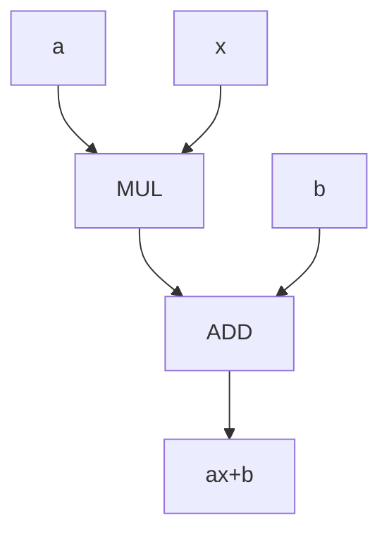
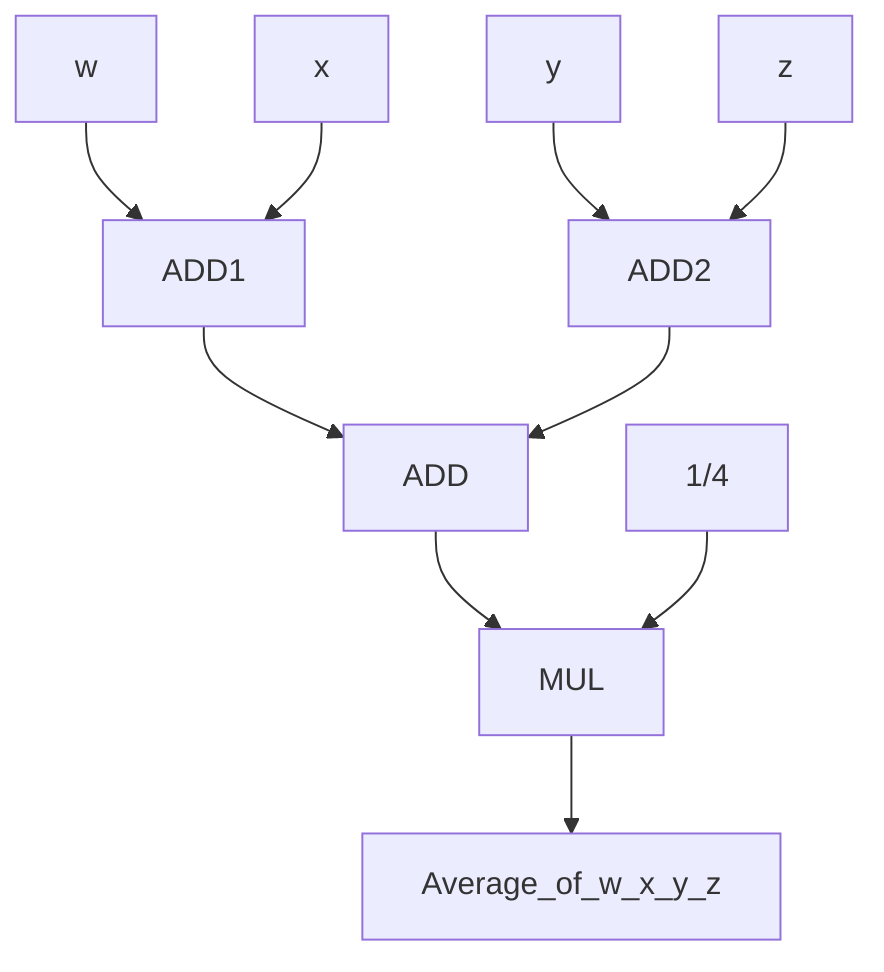
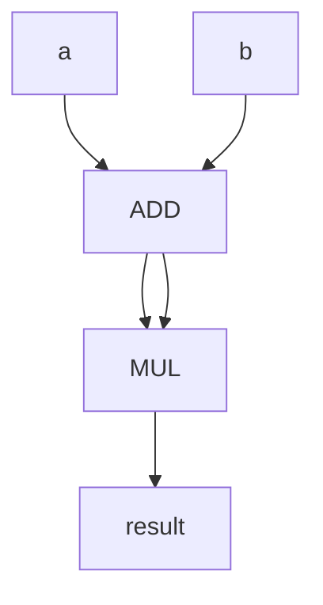
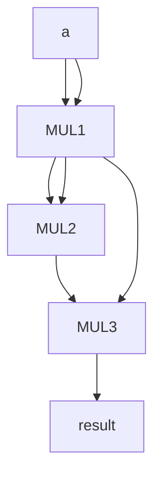

# ICS Hw1

## Author Haihan Gao

## Student number:PB18030980

## Question 1

a

b

c

d

## Question 2

a We have $$5\times 2\times 3=30  transformation$$ processes

b "C,x86,Core microarchitecture" "C++,x86,Core microarchitecture" "Pascal,x86,Core microarchitecture" 

c We have $$5\times (2+4)=30$$ transformation processes

## Question 3

a $$2^n\geq 400\ n\geq 9$$

 b 112

## Question 4

a 00010110

b 00001101

c 10001000

d 00000001

## Question 5

a 1100

b 01011000

c 1011

d 11

## Question 6

a 85

b -115

c -128

d -1

## Question 7

[22:15] 00110011

[31] 1

[30:23] 01111101

## Question 8

1+1/4+1/16+1/128+1/256=1.3242

10000010 130

value=-10.5936

## Question 9

* 0XBBFF
* 0XFFFF
* 0X4000

## Question 10

| X    | Y    | Z    | Q1   | Q2   |
| ---- | ---- | ---- | ---- | ---- |
| 0    | 0    | 0    | 0    | 1    |
| 0    | 0    | 1    | 0    | 1    |
| 0    | 1    | 0    | 0    | 1    |
| 0    | 1    | 1    | 0    | 1    |
| 1    | 0    | 0    | 1    | 1    |
| 1    | 0    | 1    | 1    | 1    |
| 1    | 1    | 0    | 1    | 1    |
| 1    | 1    | 1    | 0    | 0    |

