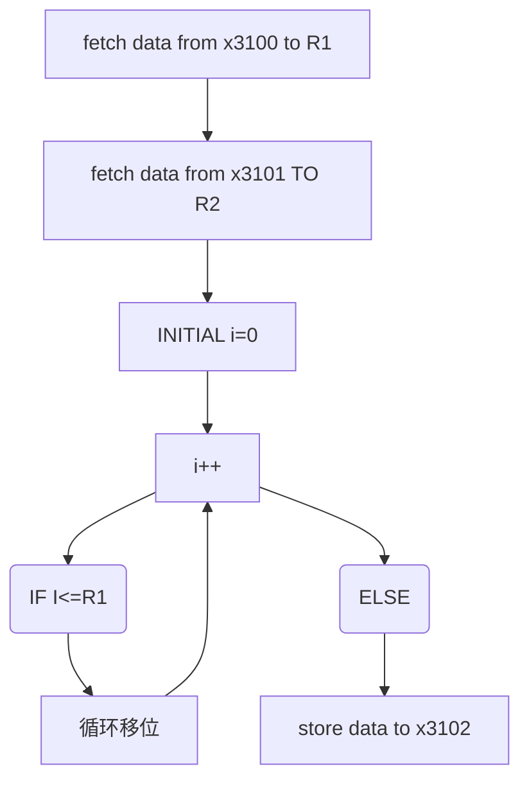

# ICS 实验一实验报告-LC-3实现

## 实验目的

* 熟悉lc-3汇编语言
* 掌握lc-3汇编语言模拟环境的使用
* 尝试使用LC-3汇编语言编程
* 掌握汇编语言编程的方法，使用机器语言编程

## 实验环境

* Windows10操作系统
* LC-3模拟器

## 实验题目分析

* 实验要求实现循环移位，但是LC-3不含有移位指令，这就需要我们利用已有的指令集的指令实现移位操作
  * 移位通过加法实现
* 循环移位可能需要在最低位补1
  * 如何检测是否补1
  * 判断操作数的正负
* 循环实现
  * 循环变量的递增，ADD
  * 循环变量和某个寄存器的值比较：采取异或逻辑运算，如果异或的结果为0，代表两个数相等，利用摩尔定律将异或转化为基本的与运算和非运算以便LC-3汇编指令处理
* 判断
  * 需要提前置标志位

## 算法概览




## 汇编语言程序设计

下面是汇编语言写成的代码，机器语言不容易让人直接理解，现在采用汇编语言展示设计

```assembly
.ORIG x3000 ; start the program at location x3000
ADD R4,R4,R4
ADD R4,R4,R4
LD R1,#253 ; store the x3100
LD R2,#253 ; store the x3101
ADD R3,R3,#0 ; clear the R3
loop ADD R3,R3,#1 ; ADD R3
ADD R4,R1,X0  ; Judge whether R1<0 
BRN ZERO
ADD R1,R1,R1	; if R1<0
ADD R1,R1,#1	; ADD 1'B1 IN THE LOW BIT OF R1
normal ADD R4,R2,X0 
ADD R5,R3,X0
NOT R4,R4 		; R4=~R4=~R2
NOT R5,R5		; R5=~R5=~R3
AND R6,R2,R5	; R6=(~R3)&R2
AND R7,R3,R4	; R7=(~R2)&R3
NOT R6,R6		
NOT R7,R7
AND R6,R6,R7
NOT R6,R6
BRNP loop
ST R1,#236		; store the data to Memory
HALT 
ZERO ADD R1,R1,R1
ADD R1,R1,#1
BRNZP normal
.END
```

对一些没加注释的行加以说明

* 第二行，第三行加上两条奇怪的ADD指令是为了让指令到内存取数据不会超过立即数表示的范围
* 从normal到BRNP loop实际上都在实现的是异或运算，利用的是如下公式
  * $A\oplus B$=$\overline {CD}$
  * C=$\overline {A\overline B}$
  * D=$\overline{B\overline A}$

## 结果验证

利用样例给出的例子验证，运行前


运行后


