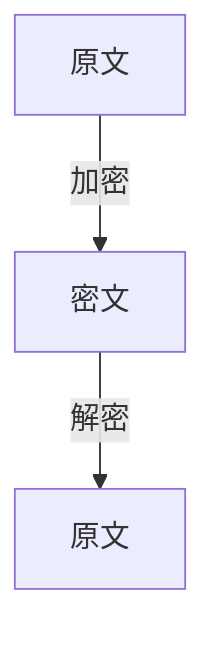

# Huffman编码

## 问题描述

在密码学中，我们常常需要将数据加密得到加密数据进行传输，接收方接收到密码之后需要对密码进行解密得到原文，所以就有了两个过程：加密与解密



在本题中，加密是将一个字符映射到一个字符串，我们需要你完成一个解密的过程

**本题中加密的原文全部由大写英文字母组成**

## 本题采用的字符映射表

| 字母 | 加密后的字符串 |
| ---- | -------------- |
| A    | 0              |
| B    | 2              |
| C    | 3              |
| D    | 4              |
| E    | 5              |
| F    | 6              |
| G    | 7              |
| H    | 8              |
| I    | 9              |
| J    | 11             |
| K    | 12             |
| L    | 13             |
| M    | 14             |
| N    | 15             |
| O    | 16             |
| P    | 17             |
| Q    | 18             |
| R    | 191            |
| S    | 192            |
| T    | 193            |
| U    | 195            |
| V    | 196            |
| W    | 197            |
| X    | 198            |
| Y    | 1991           |
| Z    | 1992           |

每个字符串的加密形式都不是其它字符串加密形式的前缀，这样就保证了解密算法的唯一性，这就是字符串的Huffman编码

## 输入

一个字符串，代表加密后的穿

## 输出

输出一行字符，即解密得到的原文,若解码失败-不存在原文与密文相对应，则输出error

## 输入输出样例

### 输入

```txt
02111971991
```

### 输出

```txt
ABJWY
```

